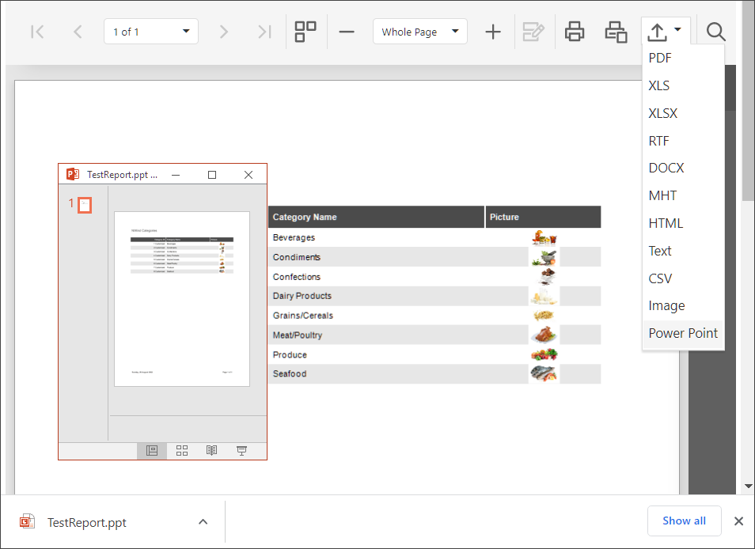

<!-- default badges list -->

<!-- default badges end -->
# Reporting for ASP.NET Web Forms - Web Document Viewer - Add PowerPoint Export Format

In this example a **Power Point** item is added to the list of availailable export formats in the Web Document Viewer, and the custom **ExportToPowerPoint** method is implemented.

The [CustomizeMenuActions](https://docs.devexpress.com/XtraReports/js-ASPxClientWebDocumentViewer#js_aspxclientwebdocumentviewer_customizemenuactions) event is handled to add a custom menu item. 

The application registers a **CustomOperationLogger** class as the [WebDocumentViewerOperationLogger](https://docs.devexpress.com/XtraReports/DevExpress.XtraReports.Web.WebDocumentViewer.WebDocumentViewerOperationLogge) service. The **CustomOperationLogger** class overrides the [ExportDocumentStarting](https://docs.devexpress.com/XtraReports/DevExpress.XtraReports.Web.WebDocumentViewer.WebDocumentViewerOperationLogger.N----F-y-----8-p) method to call the **ExportToPowerPoint** method when the user initializes export to PowerPoint.

You have to install the [Office Developer Tools](https://visualstudio.microsoft.com/vs/features/office-tools/) for Visual Studio to build the project, and have a local Microsoft Office (PowerPoint) installation to run the project.

## Files to Review

- [CustomOperationLogger.cs](CS/ReportingPowerPointExportSample/Services/CustomOperationLogger.cs) ([CustomOperationLogger.vb](VB/ReportingPowerPointExportSample/Services/CustomOperationLogger.vb))
- [Presentation.cs](CS/ReportingPowerPointExportSample/Services/CustomOperationLogger.cs) ([CustomOperationLogger.vb](VB/ReportingPowerPointExportSample/Services/Presentation.vb))
- [Global.asax.cs](CS/ReportingPowerPointExportSample/Global.asax.cs) ([Global.asax.vb](VB/ReportingPowerPointExportSample/Global.asax.vb))
- [Viewer.aspx](CS/ReportingPowerPointExportSample/Viewer.aspx) ([Viewer.aspx](VB/ReportingPowerPointExportSample/Viewer.aspx))

## Documentation

- [Blog: Exporting Reports to PowerPoint](https://community.devexpress.com/blogs/seth/archive/2011/02/14/exporting-reports-to-powerpoint.aspx)
<!-- feedback -->
## Does this example address your development requirements/objectives?

 

(you will be redirected to DevExpress.com to submit your response)
<!-- feedback end -->
